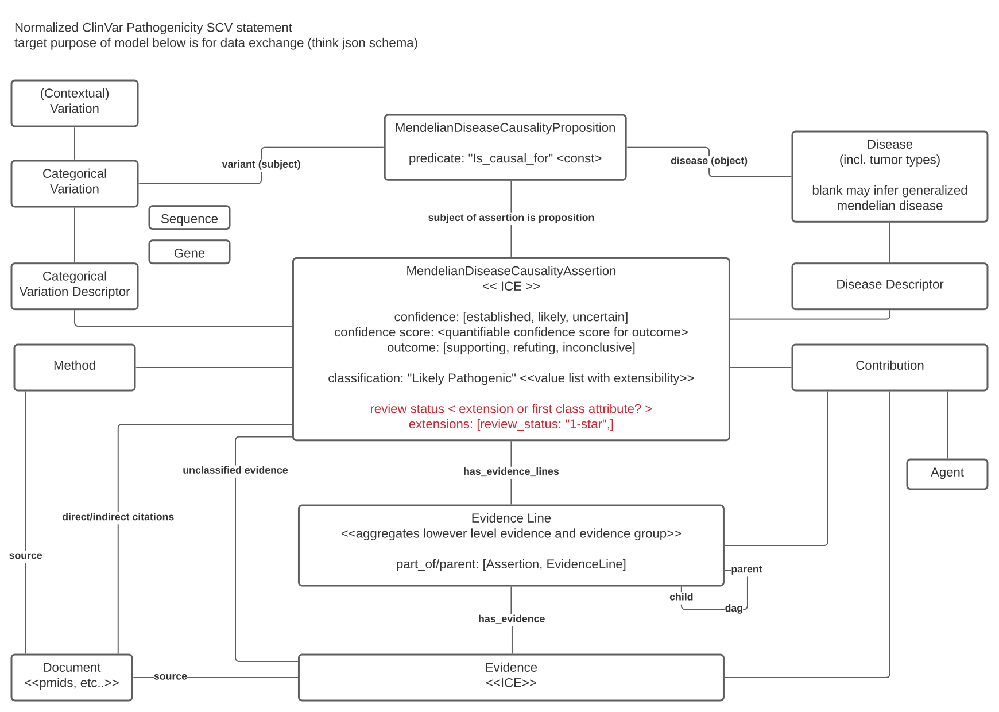

# TRAGEDY
Truly Resplendent Architecture for Genomic Evidence Discovery in YAML

**other project names considered:**

- Framework for Reproducible, Interoperable and Computable Knowledge (FRICK)
- Basically Larry's Attempt To Halt Endless Rejoinder (BLATHER)

[]
